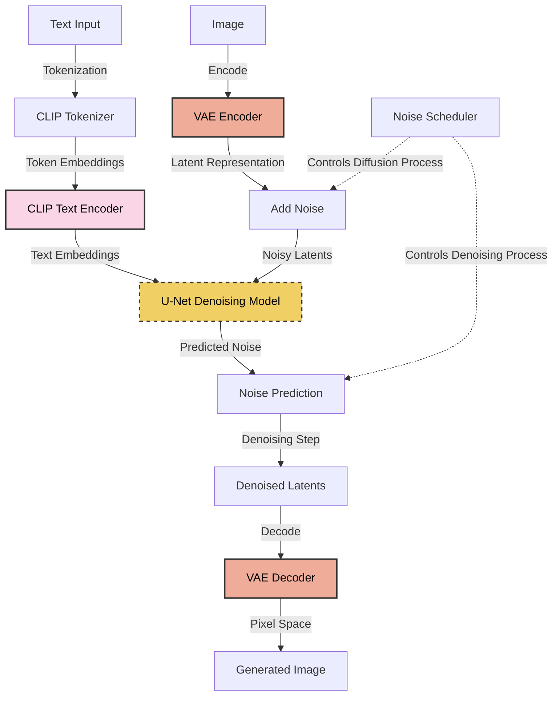
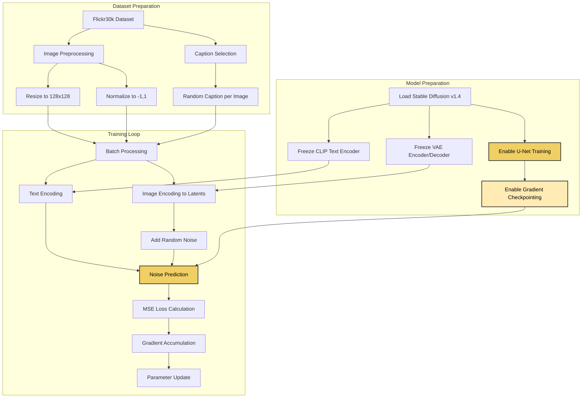
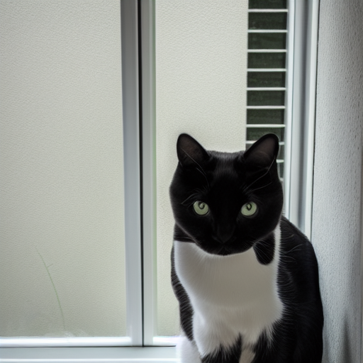
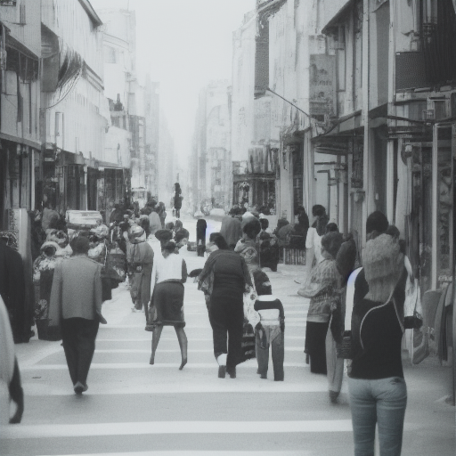
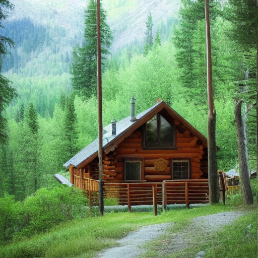
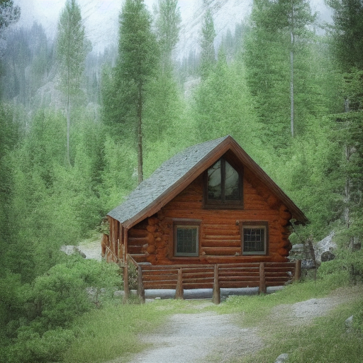
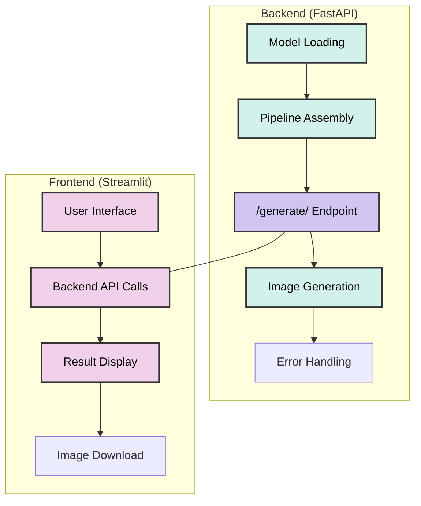

# 🖼️ Stable Diffusion Fine-tuning on Flickr30k Dataset

<div align="center">


</div>

## 📋 Table of Contents

- [Overview](#-overview)
- [Model Architecture](#-model-architecture)
- [Fine-tuning Process](#-fine-tuning-process)
- [Comparative Analysis](#-comparative-analysis)
- [Web Application](#-web-application)
- [Technical Implementation](#-technical-implementation)
- [Installation](#-installation)
- [Usage](#-usage)
- [Results](#-results)
- [License](#-license)

## 🔍 Overview

This project implements a **focused fine-tuning approach** for the **Stable Diffusion v1.4** text-to-image model, specifically adapting its **U-Net component** to the Flickr30k dataset's visual style and content distribution. The implementation strategically freezes the pre-trained **CLIP Text Encoder** and **VAE (Variational Autoencoder)** components to retain their powerful representational capabilities while allowing the U-Net to learn the unique characteristics of the dataset.

The repository delivers a complete **full-stack web application** with a **FastAPI** backend serving both the original Stable Diffusion 1.4 and the fine-tuned variant, accompanied by an interactive **Streamlit** frontend for generation, comparison, and exploration.

## 🧠 Model Architecture

Stable Diffusion operates through a complex multi-component architecture designed to progressively denoise latent representations based on text conditioning. Understanding each component is crucial for effective fine-tuning:



### Core Components

- **CLIP Text Encoder**: Transforms text prompts into a rich embedding space that guides the image generation.
  - Architecture: Transformer-based (ViT-L/14)
  - Status: **Frozen** during fine-tuning to preserve language understanding

- **VAE (Variational Autoencoder)**:
  - **Encoder**: Compresses input images into a lower-dimensional latent space
  - **Decoder**: Reconstructs images from latent representations
  - Status: **Frozen** during fine-tuning to maintain reconstruction quality

- **U-Net Denoising Model**:
  - Architecture: U-Net2DConditionModel with attention mechanisms
  - Role: Predicts noise added to latent representations
  - Status: **Exclusively fine-tuned** on Flickr30k

- **Noise Scheduler**:
  - Type: DDPM (Denoising Diffusion Probabilistic Model)
  - Function: Controls the forward and reverse diffusion processes

## 🔧 Fine-tuning Process

The fine-tuning process focuses exclusively on the U-Net component while preserving the robust pre-trained capabilities of other components:



### Training Configuration

| Parameter | Value | Rationale |
|-----------|-------|-----------|
| **Base Model** | CompVis/stable-diffusion-v1-4 | Proven stable base with good generation capabilities |
| **Resolution** | 128×128 pixels | Balance between detail and memory requirements |
| **Batch Size** | 1 | Conserve GPU memory |
| **Gradient Accumulation Steps** | 8 | Simulate effective batch size of 8 |
| **Learning Rate** | 1e-6 | Conservative rate to prevent catastrophic forgetting |
| **Weight Decay** | 1e-2 | Reduce overfitting risk |
| **Optimizer** | AdamW | Better handling of sparse gradients than SGD |
| **LR Scheduler** | Cosine with linear warmup | Smooth learning rate decay |
| **Training Epochs** | 3 | Sufficient for adaptation without overfitting |
| **Loss Function** | MSE between predicted/actual noise | Standard for diffusion models |
| **Gradient Checkpointing** | Enabled | Critical for memory efficiency |
| **Gradient Clipping** | max_norm=5.0 | Prevent exploding gradients |
| **Memory Optimization** | Aggressive cache clearing | Manage VRAM on consumer GPUs |

### Technical Implementation Highlights

```python
# Freeze CLIP text encoder and VAE parameters
text_encoder.requires_grad_(False)
vae.requires_grad_(False)
    
# Make the entire U-Net trainable
unet.requires_grad_(True)

# Enable gradient checkpointing for memory efficiency
unet.enable_gradient_checkpointing()

# Training loop with noise prediction
with torch.no_grad():
    # Get text embeddings
    text_embeddings = text_encoder(input_ids)[0]
    
    # Get image latent representations
    latents = vae.encode(pixel_values).latent_dist.sample() * 0.18215
    
    # Add noise
    noise = torch.randn_like(latents)
    timesteps = torch.randint(0, noise_scheduler.config.num_train_timesteps, (latents.size(0),), device=device)
    noisy_latents = noise_scheduler.add_noise(latents, noise, timesteps)

# Predict noise (trainable part)
noise_pred = unet(noisy_latents, timesteps, text_embeddings).sample
loss = torch.nn.functional.mse_loss(noise_pred, noise) / gradient_accumulation_steps
```

### Data Processing Pipeline

The Flickr30k dataset used for fine-tuning contains 31,000 images, each with multiple captions. Our processing pipeline:

1. **Image Processing**:
   - Resize to 128×128 pixels
   - Convert to RGB 
   - Normalize pixel values to [-1, 1]

2. **Caption Selection**:
   - Randomly select one caption per image to reduce bias
   - Apply CLIP tokenization with max length 77

3. **Latent Conversion**:
   - Convert images to latent space using frozen VAE
   - Apply scaling factor of 0.18215 (model-specific constant)

## 📊 Comparative Analysis

The fine-tuned model demonstrates distinct adaptations to the Flickr30k dataset's characteristics, particularly in photorealism, composition, and stylistic elements.

### Stylistic Tendencies

| Prompt | Original Model | Fine-tuned Model | Analysis |
|--------|----------------|------------------|----------|
| A person walking on the beach |  |  | The fine-tuned model produces more photorealistic lighting and natural human proportions. Background beach elements appear more natural and less artificially perfect. |
| A cat sitting on a windowsill |  |  | Notable difference in style, with the fine-tuned model preferring a more documentary-style framing typical of dataset photos. The original produces a closer, more staged composition. |
| People on a city street |  |  | The fine-tuned model demonstrates a preference for historical or documentary-style street scenes consistent with Flickr30k's diverse image collection. Note clothing style differences and architectural rendering. |
| A cabin in the mountains |  |  | Both models perform well but with different artistic approaches. The fine-tuned model produces more consistent lighting and realistic log textures, suggestive of adaptation to photographic rather than artistic interpretations. |
| A person reading a book |  |  | Fascinating subject variation: the fine-tuned model depicts a child reading, while the original shows an adult. This suggests population-level adaptation to the dataset's subject distribution. |

### Key Observations

1. **Photorealistic Tendency**: The fine-tuned model consistently produces images with lighting, texture, and composition closer to real photographs than to digital art.

2. **Subject Demographics**: The fine-tuned model appears to reflect demographic patterns from the Flickr30k dataset, possibly preferring subject types most common in the training data.

3. **Compositional Bias**: Fine-tuned outputs show documentary-style compositions rather than the more cinematically framed compositions of the original model.

4. **Temporal Adaptation**: Some prompts reveal a tendency toward historical or vintage renderings, suggesting temporal biases in the dataset.

5. **Architectural Detail**: Building details in the fine-tuned model show more photographic realism but sometimes less fantasy/creativity compared to the original model.

## 💻 Web Application

The web application consists of a decoupled architecture with a FastAPI backend and Streamlit frontend:



### Backend Architecture

The FastAPI backend implements several key optimizations:

1. **Component Sharing**: Both original and fine-tuned models share common components (VAE, Text Encoder, Tokenizer) to reduce memory usage.

2. **Dynamic Device Selection**: Automatically uses CUDA → MPS → CPU in order of preference.

3. **Memory Management**: Implements aggressive memory clearing and gradual model loading to prevent OOM errors.

4. **Precision Adaptation**: Uses float16 for CUDA, float32 for MPS/CPU for optimal performance/stability balance.

5. **Asynchronous Loading**: Loads models in background threads to prevent blocking the web server.

```python
# Efficient component sharing pseudocode
shared_components = {
    "vae": app_state["vae"],
    "text_encoder": app_state["text_encoder"],
    "tokenizer": app_state["tokenizer"],
    "scheduler": app_state["scheduler"],
    # Safety components disabled for performance
    "safety_checker": None,
    "feature_extractor": None,
    "requires_safety_checker": False,
}

# Assemble pipelines with shared components
app_state["original_pipe"] = StableDiffusionPipeline(
    unet=app_state["original_unet"], **shared_components
)
app_state["fine_tuned_pipe"] = StableDiffusionPipeline(
    unet=app_state["fine_tuned_unet"], **shared_components
)
```

### Frontend Features

The Streamlit frontend offers a user-friendly interface with:

1. **Dual-model Generation**: Generate with the original model, fine-tuned model, or both simultaneously.

2. **Advanced Controls**: Adjust inference steps, guidance scale, and random seed.

3. **Example Prompts**: Built-in prompt suggestions for easier exploration.

4. **Direct Comparison**: Side-by-side comparison of results from both models.

5. **Image Download**: One-click download of generated images.

6. **Responsive Design**: Adaptive layout for different screen sizes.

7. **Status Monitoring**: Backend status checks and error reporting.

## 🛠 Technical Implementation

### Memory Optimization Techniques

The implementation employs several memory optimization techniques to enable training and inference on consumer-grade hardware:

1. **Gradient Checkpointing**: Reduces memory usage by recomputing intermediate activations during backward pass instead of storing them.

2. **Gradient Accumulation**: Enables training with effective batch sizes larger than hardware limits.

3. **Mixed Precision**: Uses float16 for CUDA acceleration while maintaining float32 for MPS compatibility.

4. **Model Parallelism**: Option for distributed training across multiple GPUs.

5. **Aggressive Cache Clearing**: Explicit memory management at critical points in the processing pipeline.

6. **Component Sharing**: Prevents redundant model loading by sharing frozen components.

### Technical Challenges and Solutions

| Challenge | Solution | Implementation |
|-----------|----------|----------------|
| CUDA OOM Errors | Gradient checkpointing, accumulation | `unet.enable_gradient_checkpointing()` |
| MPS Numerical Instability | Force float32 precision on Apple Silicon | `TORCH_DTYPE = torch.float32 if device == "mps" else torch.float16` |
| Training Progress Monitoring | Distributed-aware progress tracking | Synchronized progress bars with loss logging |
| Model Serialization | Efficient checkpoint saving | Save only U-Net component, not full pipeline |
| Inference Throughput | Attention slicing for inference | `pipe.enable_attention_slicing()` |
| Black Image Generation | Device-specific troubleshooting | Apple Silicon workarounds in backend |

## 📥 Installation

1. **Clone the repository**:
   ```bash
   git clone https://github.com/dina-fdu/flickr30k-model.git
   cd flickr30k-model
   ```

2. **Create and activate a virtual environment**:
   ```bash
   python -m venv .venv
   source .venv/bin/activate  # On Windows: .venv\Scripts\activate
   ```

3. **Install dependencies**:
   ```bash
   pip install -r requirements.txt
   ```

## 🚀 Usage

### Running the Web Application

1. **Start the FastAPI backend**:
   ```bash
   uvicorn backend_app:app --host 0.0.0.0 --port 8000
   ```
   Wait for confirmation that models have been loaded.

2. **Start the Streamlit frontend** (in a new terminal):
   ```bash
   streamlit run frontend_app.py
   ```
   Access the UI via the provided URL (typically http://localhost:8501).

### Fine-Tuning (Optional)

To fine-tune the model on your own dataset:

1. **Prepare data** in the format of Flickr30k (images + captions.txt).

2. **Modify paths** in `fine_tune_stable_diffusion_flickr30k.py`.

3. **Run fine-tuning**:
   ```bash
   # Single GPU
   python fine_tune_stable_diffusion_flickr30k.py
   
   # Multi-GPU
   torchrun --nproc_per_node=<num_gpus> fine_tune_stable_diffusion_flickr30k.py
   ```

### Inference Script

For standalone comparison testing:

```bash
python inference.py
```
Alternatively


` USE THE INFERENCE.IPYNB Notebook`

## 📊 Results

The fine-tuned model demonstrates several key adaptations:

1. **Dataset-Specific Style**: Clear adaptation to the photographic style and content distribution of Flickr30k.

2. **Realistic Lighting**: More natural light rendering in outdoor scenes.

3. **Compositional Changes**: Tendency toward documentary-style framing versus cinematic compositions.

4. **Subject Variation**: Changes in demographic representation reflecting dataset biases.

5. **Detail Preservation**: Enhanced performance on scene types well-represented in Flickr30k.